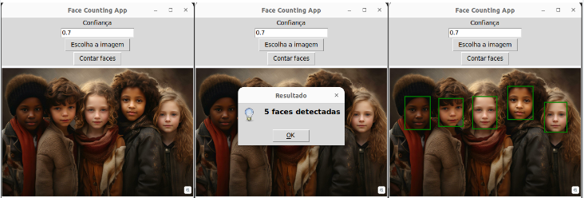

# Face Counting App


Este é um aplicativo simples de contagem de faces desenvolvido em Python, utilizando a biblioteca `facenet-pytorch` para detecção de faces com MTCNN e uma interface gráfica criada com Tkinter.

A MTCNN (Multi-task Cascaded Convolutional Networks) é uma rede neural multicamada que usa uma cascata de três redes neurais convolucionais: P-Net, R-Net e O-Net, para detectar faces em uma imagem, além de localizar pontos faciais (landmarks) e gerar as caixas delimitadoras(bounding boxes). Com cada uma dessas redes os resultados são refinados apartir dos resultados da camada anterior fazendo com que a detecção seja mais precisa.

## Funcionalidades

- [x] Detecção e contagem de faces em uma imagem.
- [x] Interface gráfica para escolha da imagem e visualização dos resultados.
- [x] Configuração do limiar de confiança para a detecção das faces.
- [x] Exibição da imagem com marcação das faces detectadas.


```bash
pip install torch facenet-pytorch pillow
```

## Tecnologias Utilizadas

- **Python**: Linguagem de programação principal.
- **Tkinter**: Interface gráfica.
- **facenet-pytorch (MTCNN)**: Detecção de faces.

## Requisitos

Certifique-se de ter as seguintes bibliotecas instaladas:


## Demonstração



